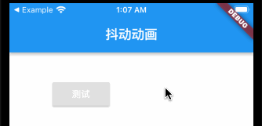
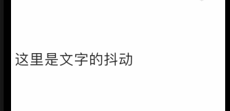
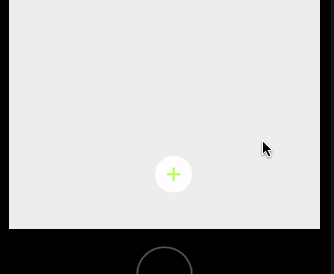
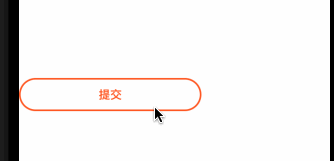
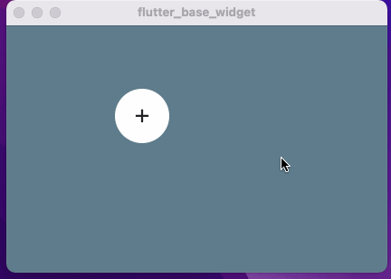

# flutter_shake_animation_widget
Flutter抖动动画组件，FLutter颤动动画


#### 1 抖动效果



```
  ///构建抖动效果
  ShakeAnimationWidget buildShakeAnimationWidget() {
    return ShakeAnimationWidget(
      //抖动控制器
      shakeAnimationController: _shakeAnimationController,
      //微旋转的抖动
      shakeAnimationType: ShakeAnimationType.SkewShake,
      //设置不开启抖动
      isForward: false,
      //默认为 0 无限执行
      shakeCount: 0,
      //抖动的幅度 取值范围为[0,1]
      shakeRange: 0.2,
      //执行抖动动画的子Widget
      child: RaisedButton(
        child: Text(
          '测试',
          style: TextStyle(color: Colors.white),
        ),
        onPressed: () {
          ///判断抖动动画是否正在执行
          if (_shakeAnimationController.animationRunging) {
            ///停止抖动动画
            _shakeAnimationController.stop();
          } else {
            ///开启抖动动画
            ///参数shakeCount 用来配置抖动次数
            ///通过 controller start 方法默认为 1
            _shakeAnimationController.start(shakeCount: 1);
          }
        },
      ),
    );
  }
```
#### 2 抖动的文本



```
  buildTextAnimationWidget() {
    return ShakeTextAnimationWidget(
      //需要设置抖动效果的文本
      animationString: "这里是文字的抖动",
      space: 1.0,
      //字符间距
      runSpace: 10,
      //行间距
      //文字的样式
      textStyle: const TextStyle(
        ///文字的大小
        fontSize: 25,
      ),
      //抖动次数
      shakeCount: 0,
    );
  }
```


#### 3 防开源中国自定义底部菜单




```
      BottomRoundFlowMenu(
          //图标使用的背景
          defaultBackgroundColor: Colors.white,
          //菜单所有的图标
          iconList: iconList,
          //对应菜单项点击事件回调
          clickCallBack: (int index) {
            print("点击了 $index");
          },
        )
```

#### 4 动画按钮



```
  //动画按钮使用到的控制器
  AnimatedStatusController animatedStatusController =
  new AnimatedStatusController();

  //切换样式的动画按钮
  Widget buildAnimatedStatusButton() {
    return AnimatedStatusButton(
      //控制器
      animatedStatusController: animatedStatusController,
      //显示按钮的宽度
      width: 220.0,
      //显示按钮的高度
      height: 40,
      //动画交互时间
      milliseconds: 1000,
      buttonText: '提交',
      //背景颜色
      backgroundNormalColor: Colors.white,
      //边框颜色
      borderNormalColor: Colors.deepOrange,
      //文字颜色
      textNormalCcolor: Colors.deepOrange,
      //点击回调
      clickCallback: () async {
        print("点击事件回调");
        //模拟耗时操作
        await Future.delayed(Duration(milliseconds: 4000));

        //返回false 会一直在转圈圈
        //返回true 会回到默认显示样式
        return Future.value(false);
      },
    );
  }

```


#### 5 垂直向上弹出菜单


```
    RoteFlowButtonMenu(
          //图标使用的背景
          defaultBackgroundColor: Colors.deepOrangeAccent,
          //菜单所有的图标
          iconList: iconList,
          //对应菜单项点击事件回调
          clickCallBack: (int index) {
            print("点击了 $index");
          },
        )
```

#### 6 页面悬浮可托动按钮


```

class _Exam223HomePageState extends State<Exam223HomePage> {
  //Stack使用的Key
  final GlobalKey _parentKey = GlobalKey();

  @override
  Widget build(BuildContext context) {
    return Scaffold(
      body: SizedBox(
        width: double.infinity,
        height: double.infinity,
        child: Stack(
          key: _parentKey,
          children: [
            Container(color: Colors.blueGrey),

            DraggableFloatingActionButton(
              child: Container(
                width: 60,
                height: 60,
                decoration: const ShapeDecoration(
                  shape: CircleBorder(),
                  color: Colors.white,
                ),
                child: const Icon(Icons.add),
              ),
              initialOffset: const Offset(120, 70),
              parentKey: _parentKey,
              onPressed: () {},
            ),
          ],
        ),
      ),
    );
  }
}
```
